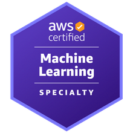
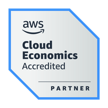
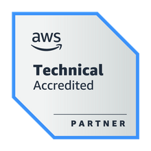

### Hello 👋 I'm Olzhas Alexandrov

I'm a full stack developer who is [Expert-Vetted](https://support.upwork.com/hc/en-us/articles/360049625454-Expert-Vetted-Talent) on [UpWork](https://www.upwork.com/freelancers/~018e2d48fa8a42e825). Whether it's a web, mobile, or a desktop app, I could develop it for you. Or, if you already have a solution and want to decrease complexity or operating costs, incorporating Machine Learning on the backend and/or built-into the app, I could assist you with that too.

### Rate

The hourly rate and any fixed-rate projects are subject to a minimum commitment of $20,000.

- $120/hour

## Certifications 🎓

### Let's Connect 🔗

